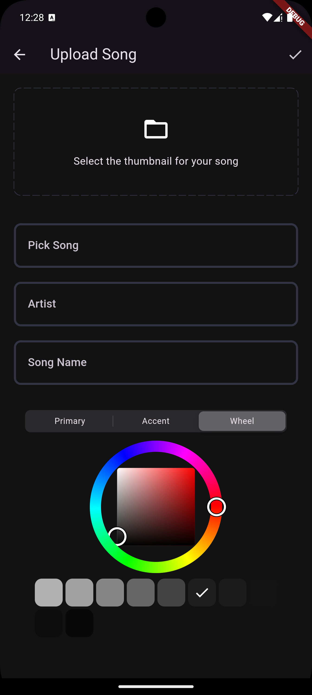

# Spotify Clone Mobile Application

A full-stack music streaming application that replicates the core functionalities of **Spotify**. This project showcases my skills in **Flutter** for mobile development, **FastAPI** for backend services, **PostgreSQL** with **SQLAlchemy ORM** for database management, and **Cloudinary** for media management. The app allows users to listen to music, upload new tracks, manage playlists, and perform various other tasks in a Spotify-like environment.

## Table of Contents

- [Features](#features)
  - [Authentication & Authorization](#authentication--authorization)
  - [Music Library](#music-library)
  - [Background Music Playback](#background-music-playback)
  - [Song Upload & Media Storage](#song-upload--media-storage)
  - [User Interface Design](#user-interface-design)
- [Tech Stack](#tech-stack)
  - [Frontend (Flutter)](#frontend-flutter)
  - [Backend (FastAPI)](#backend-fastapi)
  - [Cloud Integration (Cloudinary)](#cloud-integration-cloudinary)
  - [Database Management (PostgreSQL & SQLAlchemy)](#database-management-postgresql-sqlalchemy)
- [Video Demo](#video-demo)
- [Images](#images)
- [Conclusion](#conclusion)

## Features

### Authentication & Authorization

The application implements a **secure authentication and authorization** system using **JWT tokens**, allowing users to securely log in and maintain sessions across devices. By leveraging **Flutter Riverpod** for state management, the app efficiently manages authentication flow, user sessions, and token persistence through `shared_preferences`.

- **Secure Login/Registration:** Ensures that user credentials are protected via token-based authentication.
- **Session Management:** Tokens are securely stored locally using `shared_preferences`, ensuring that users remain logged in even after closing the app.
- **Authorization:** Certain features, such as song uploads and favoriting, are only available to authenticated users, ensuring proper user-role management.

### Music Library

The app dynamically manages a user’s music library, providing options to explore **newly uploaded songs** and **recently played tracks**. It pulls song metadata and media directly from **Cloudinary** and stores essential song information in **PostgreSQL**, ensuring fast and secure access to audio files.

- **Dynamic Song List:** Users can view a constantly updated list of newly uploaded songs and their recently played songs.
- **Favorites Management:** Users can easily mark songs as favorites, which are stored both locally and in **PostgreSQL** for persistent access across devices.

### Background Music Playback

One of the core features of the application is its ability to play music in the background, allowing users to enjoy continuous playback even when the app is minimized or the screen is turned off. This is achieved using **just_audio** and **just_audio_background**, which deliver a smooth and uninterrupted audio experience.

- **Seamless Playback:** Supports all essential playback controls (play, pause, skip) and operates smoothly even when the app is in the background.
- **Audio Waveform Visualization:** Utilizes the `audio_waveforms` package to render an audio waveform, providing users with a more immersive and engaging experience during playback.
- **Playback Across Devices:** Users can resume playback across devices, maintaining state and playback continuity.

### Song Upload & Media Storage

The app allows users to upload songs and related media (thumbnails) directly from their device. Integration with **Cloudinary** enables efficient handling of media storage, ensuring fast, scalable, and reliable access to uploaded content.

- **File Uploading:** Supports both song file and associated thumbnail uploads, utilizing **Cloudinary** for media storage and management.
- **Cloud Storage Integration:** Ensures that media files are stored securely in the cloud, providing fast and scalable access to music files.
- **Efficient Media Retrieval:** Songs and thumbnails are retrieved dynamically from Cloudinary, optimizing performance and user experience.

### User Interface Design

The user interface mimics the familiar design of **Spotify**, ensuring users feel comfortable navigating the app. Developed using **Flutter**, the UI is highly responsive, fast, and scalable across platforms, providing a consistent experience on both Android and iOS.

- **Spotify-Like UI:** The app's design is intuitive and closely resembles Spotify’s layout, making it easy for users to browse songs, playlists, and controls.
- **Custom Themes:** Allows users to personalize the color scheme using the `flex_color_picker` package, offering a visually appealing and customizable experience.

## Tech Stack

### Frontend (Flutter)

The frontend is developed using **Flutter**, leveraging the following technologies:

- **State Management:** Utilizes **Riverpod** and **fpdart** for efficient state management and functional programming paradigms, ensuring that the app is reactive and scalable.
- **Local Storage:** Uses **Hive** and **shared_preferences** to manage user data, including session tokens and cached music information.
- **Audio Playback:** The audio engine is powered by **just_audio**, with background playback enabled via **just_audio_background**, ensuring seamless audio streaming.
- **UI/UX:** Custom animations and flexible color themes using `flex_color_picker` offer users a visually appealing and interactive experience.

### Backend (FastAPI)

The backend is built using **FastAPI**, providing high-performance, asynchronous APIs for handling user authentication, song uploads, and media retrieval.

- **RESTful API Design:** Exposes a set of secure API endpoints for user management, song uploads, and media access.
- **Asynchronous Processing:** Utilizes Python's asynchronous features, ensuring that the app can handle concurrent requests efficiently.
- **Security:** Implements secure token-based authentication, protecting the app from unauthorized access while ensuring data integrity.

### Cloud Integration (Cloudinary)

**Cloudinary** handles all media storage, offering fast and reliable access to audio files and thumbnails.

- **Media Management:** Allows users to upload songs and thumbnails, which are then stored and managed in Cloudinary.
- **Scalable Storage:** Ensures that large volumes of media files can be efficiently stored and retrieved.
- **Media Optimization:** Delivers optimized audio and image content, reducing load times and enhancing user experience.

### Database Management (PostgreSQL & SQLAlchemy)

The app uses **PostgreSQL** as the primary relational database, managed through **SQLAlchemy ORM**, ensuring that song metadata, user data, and favorites are securely stored and retrieved efficiently.

- **Relational Data Modeling:** The database schema is designed to store user data, song metadata, and playback history, allowing for efficient querying and secure access.
- **SQLAlchemy ORM:** Used to handle all database transactions and efficiently map Python objects to database tables, ensuring seamless interaction between the app and the database.

## Video Demo

Check out the video demo of the Spotify Clone in action:

[![Watch the video]](https://res.cloudinary.com/dkuand2eu/video/upload/v1728448112/cb7qfcffwdcjutx27plx.webm)

This video demonstrates all the core features of the application, including:

- User authentication and session management.
- Song upload functionality.
- Music playback with background support.
- UI/UX showcasing the Spotify-like design.

## Images

Below are screenshots of the app in action:

| Home Screen                        | Favorites Screen                       | Upload Screen                          |
| ---------------------------------- | -------------------------------------- | -------------------------------------- |
|  |  |  |

| User Profile                       | Signup Screen                          | Signup Screen (Alt)                    |
| ---------------------------------- | -------------------------------------- | -------------------------------------- |
|  |  |  |

## Conclusion

This project is a complete demonstration of my full-stack mobile development capabilities. From integrating **Flutter** for frontend mobile app development to designing high-performance **FastAPI** backend services and leveraging **PostgreSQL** with **SQLAlchemy ORM** for database management, this application showcases a robust, real-world solution for music streaming services.

It highlights not only my ability to build performant applications but also my expertise in designing secure, scalable, and user-friendly mobile apps. Feel free to explore the codebase to gain insight into the various technologies and design patterns employed.
